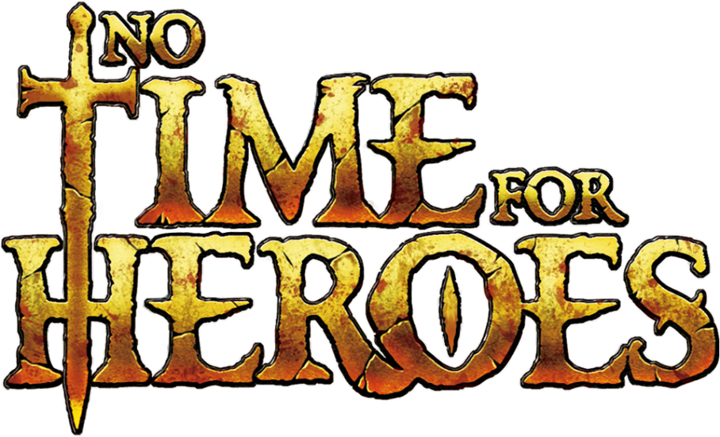

# Enlaces Importantes

- URL al video de explicación de normas del juego: 

- URL al video de demostración de la aplicación: 

# Participantes del Proyecto

- Álvaro Hidalgo Rodríguez
- Pedro Jesús Ruiz Aguilar
- Ismael Ruiz Jurado
- Laura Roldán Merat
- Iván Sánchez Sanjose
- Alejandro Santiago Félix

# Descripción del Juego

"No Time For Heroes" es un juego estratégico de cartas con una dinámica de juego para dos a cuatro jugadores (incluyendo también un modo solitario no implementado), cuyas partidas tienen una duración aproximada de entre 20 y 40 minutos. El objetivo del juego es alcanzar la máxima gloria posible, ya sea a través de la eliminación de orcos o la acumulación de riquezas.

En este juego hay cinco tipos de cartas:

- **Héroes**: Estas cartas representan a los valerosos personajes que los jugadores pueden seleccionar para sus partidas. Cada uno de estos héroes cuenta con una serie de efectos y capacidades, que no solo afectarán al cálculo de daño final en batalla contra los orcos, sino también a las decisiones que los jugadores tomarán en relación a las compras en la tienda. Los jugadores pueden elegir uno o dos héroes para cada partida.

- **Habilidades**: Estas cartas representan el arsenal de técnicas y habilidades que cada héroe posee, son una manifestación de su valentía y astucia en batalla, diseñadas para causar un impacto devastador en los orcos enemigos y cuyos efectos son de gran importancia en el desarrollo de la partida, pudiendo ser el factor crucial que determina la victoria sobre la derrota.

- **Productos**: Estas cartas representan los objetos y armamentos que pueden ser adquiridos en la tienda en el transcurso de la partida, siempre y cuando el héroe posea las capacidades necesarias para hacerlo. Al igual que las habilidades, estos productos poseen una serie de efectos y habilidades que pueden ser utilizadas para causar daño a los orcos, pero deben ser adquiridos durante el desarrollo de la partida, y no se encuentran disponibles desde el comienzo del juego.

- **Enemigos**: Estas cartas representan a las entidades hostiles que los héroes deben enfrentar en su aventura, cuyo objetivo es eliminar a los héroes. Entre estos enemigos, se pueden distinguir a los orcos comunes y a los señores de la guerra, los cuales se diferencian entre sí en cuanto a su vitalidad, efectos durante la partida y recompensa al ser vencidos. Los señores de la guerra, al ser los últimos enemigos a enfrentar, poseen una mayor vitalidad, aplican efectos durante la partida, y su recompensa se da por cada carta utilizada en su derrota en lugar de darla al morir, como es el caso de los orcos comunes.

  
  

- **Escenarios**(no están implmentados): Escenarios (no implementados): Estas cartas representan el lugar donde se librará la batalla épica entre los héroes y los orcos. Cada uno de estos escenarios poseerá su propia ambientación, condiciones y desafíos únicos, que agregarán una dimensión adicional al juego, y que harán que cada partida sea una experiencia distinta y emocionante.

Al inicio del juego, cada participante elegirá a los héroes que desea utilizar (ya sea uno o dos) y asignará las habilidades correspondientes de acuerdo a los roles de cada uno de los héroes. Posteriormente, se procederá a seleccionar aleatoriamente dos cartas, y el jugador que cause mayor daño iniciará el juego. En caso de empate, el jugador con mayor edad tendrá prioridad.

Tras el comienzo de la partida, cada turno se divide en varias fases:

- **Elección estratégica**: Durante esta fase, el jugador deberá elegir entre evitar el embate de los orcos (esto sólo será posible en una ocasión durante el juego) o emprender una acción ofensiva contra ellos.

- **Evasión**: Durante este turno, el jugador deberá sacrificar al menos dos cartas con el objetivo de eludir el ataque de los orcos, accediendo de manera directa a la fase del mercado.

- **Ataque de los héroes**: Durante este turno, el personaje principal tendrá la opción de emplear las cartas de habilidad para infligir daño a los orcos y, en consecuencia, adquirir riquezas y gloria.

- **Ataque de los orcos**: Durante este turno, los orcos embestirán contra el jugador que los haya atacado en la fase ofensiva, utilizando la vida que aún les quede.

- **Mercado**: Durante este turno, el jugador tendrá la posibilidad de adquirir artículos en la tienda, siempre y cuando cuente con las capacidades necesarias para su uso.

- **Reestablecimiento**: En este turno, el participante que tenga el mando de juego, será responsable de incorporar a la arena de combate los orcos que falteen y, además, si cuenta con una cantidad superior a 5 cartas, deberá descartar algunas hasta alcanzar la cantidad de 5, en caso contrario, deberá recoger cartas hasta llegar a esa cifra.

El juego concluirá cuando el señor de la guerra sea derrotado, en ese momento se llevará a cabo el cálculo de las puntuaciones y aquel que haya alcanzado una mayor gloria será declarado ganador.

